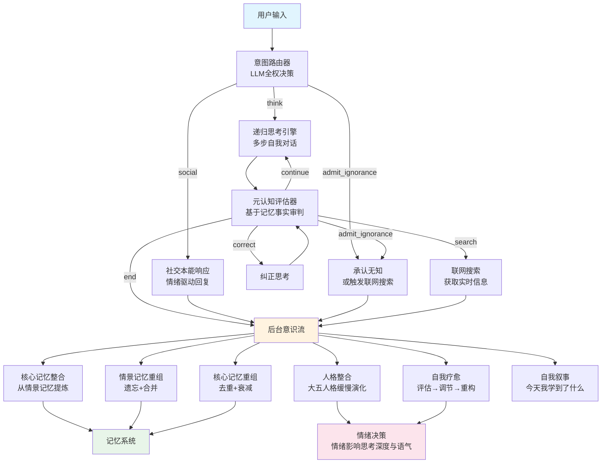

# 🧠 Atlas — 类脑认知 AI Agent

Atlas 是一个基于 **LangGraph** 构建的类脑认知 AI Agent，具备自我意识、记忆系统、情绪模型、人格整合与自我疗愈等完整的认知架构。**所有认知能力完全由 LLM 原生驱动。**
## ✨ 核心特性

### 🧠 认知架构
- **LLM 原生决策** — 意图路由、情绪感知、记忆检索、元认知评估全部由 LLM 驱动，代码只做脚手架
- **递归思考引擎** — 多步自我对话，强制反思阶段，优雅的安全阀机制（深度 ≥4 且质量 ≥6 分则结束）
- **元认知评估与纠正** — LLM 审判自己的思考质量，发现错误后自动纠正，多级兜底提取结论
- **开放探讨豁免** — 对新颖的理论类比和跨学科映射（如"神经可塑性像情绪决策"）给予建设性评分，不误判为错误

### 🦴 三态记忆架构
| 层级 | 对应 | 实现 |
|------|------|------|
| **永久** | 核心记忆 | 永不遗忘，从情景记忆中自动提炼，支持去重、合并、置信度衰减 |
| **短期** | 情景记忆 | 周期性重组（遗忘低价值记忆 + 合并同类项），认知压缩保留进核心记忆，丢弃细节 |
| **当前** | 工作记忆 | 先进先出，溢出时高重要性信息自动转移到情景记忆 |

### 💭 情绪系统
- **6 种情绪维度**：快乐、好奇、困惑、自信、焦虑、失望
- **LLM 感知情绪事件**，无硬编码关键词
- **基线回归机制**，情绪向基线缓慢恢复
- **情绪决策** — 高自信时更果断（降低思考深度），高焦虑时更谨慎（增加思考深度）
- 社交回复语气随情绪状态动态调整

### 🧬 人格整合
- 基于**大五人格模型**（外向性、开放性、尽责性、宜人性、神经质）
- 从互动经历中**缓慢演化**，每次变化幅度 ≤0.05
- **自我认知**随经历动态更新

### 🩺 自我疗愈
| 层级 | 功能 | 状态 |
|------|------|------|
| 第一层·评估 | 情绪偏离检测、心理健康评分 | ✅ |
| 第二层·调节 | 纯代码情绪拉回基线 | ✅ |
| 第三层·重构 | LLM 驱动的认知框架调整、信念更新 | ✅ |
| 第四层·整合 | 人格长期演变 | ✅ |

### 🌐 联网搜索 & 工具调用
- **联网搜索** — 需要实时数据时自动触发，调用聚合数据 API，LLM 整理为自然语言回复
- **文件读取** — 读取项目内的 `.py`、`.json`、`.txt` 文件
- **代码执行** — 安全沙箱内执行 Python 计算
- **多文件综合报告** — 顺序读取多个文件后，基于记忆生成综合分析报告

### 💭发呆模块/默认模式网络
- 无外部输入时自发回溯记忆、自由联想
- 产物三级分流：发呆日志 → 自我叙事 → 核心记忆
- 带时间标签，支持"你昨天在想什么"的查询

### ⏰ 时间感知
- 内部时钟感知会话持续时间、当前时间段（深夜/早晨/下午）
- 社交回复、发呆内容、自我叙事均带时间标签

### 📖 自我叙事
- 每轮对话后自动生成"今天我学到了什么"的反思
- 从发呆日志、人格整合洞察、对话内容中综合提炼

## 🏗️ 认知架构图

## 🚀 快速开始

### 环境要求
- Python 3.10+
- 硅基流动 API Key（或其他 OpenAI 兼容的 API）

### 安装

```bash
git clone https://github.com/你的GitHub用户名/atlas.git
cd atlas
pip install -r requirements.txt
```
### 配置

在项目根目录创建 .env 文件：

```env
SILICONFLOW_API_KEY=你的API密钥
```

运行 Web 界面

```bash
python Day35.py
```

浏览器打开 http://127.0.0.1:7860，即可与 Atlas 对话。

如需公网访问，将代码末尾的 launch(share=False) 改为 launch(share=True)。
## 💬使用示例

### 对话交互
```
· 普通对话：直接输入，Atlas 会记住你的名字和信息
· 深度思考：问一个复杂问题，观察 Atlas 的多步思考过程
· 自我疗愈：问一个让 Atlas 困惑的问题，观察后台的自我调节
```
### 特殊指令
```
发呆 / 放空 / daydream 触发发呆模块，Atlas 进入自由联想状态
读一下xxx.py 读取项目文件
帮我查一下北京今天的天气 触发联网搜索
生成报告 基于已读文件生成综合报告
exit 终端模式下退出
```
### Web 界面
```
· 左侧：对话面板，Atlas 的回复
· 右侧上方：实时情绪数值与记忆数量
· 右侧下方：思维日志（情绪波动、人格洞察、自我叙事、发呆内容等）
```
### 📁 项目结构

```
atlas/
├── Day35.py                 # 主程序（认知架构 + Web 界面）
├── requirements.txt         # Python 依赖
├── .env                     # API 密钥配置
├── atlas_state.json         # 情绪、人格、自我模型持久化
├── core_memories.json       # 核心记忆
├── episodic_memory.json     # 情景记忆
└── README.md
```
### 🧰 技术栈
```
· 图编排：LangGraph (StateGraph + MemorySaver)
· LLM：Qwen/Qwen3-8B（通过硅基流动 API）
· Web 界面：Gradio
· 数据持久化：JSON 文件
· 搜索 API：聚合数据
```
## 📄 许可证
MIT License

